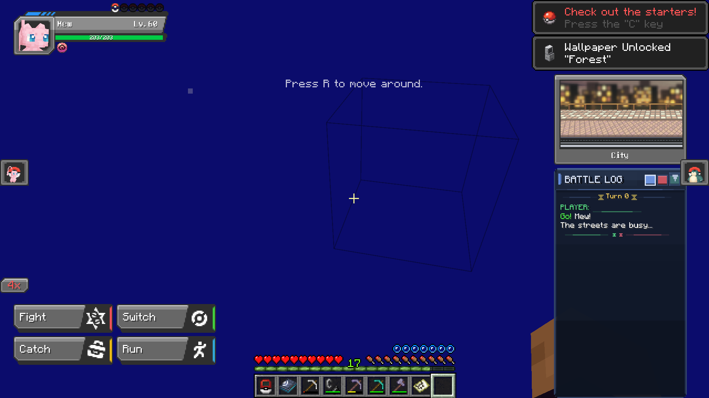
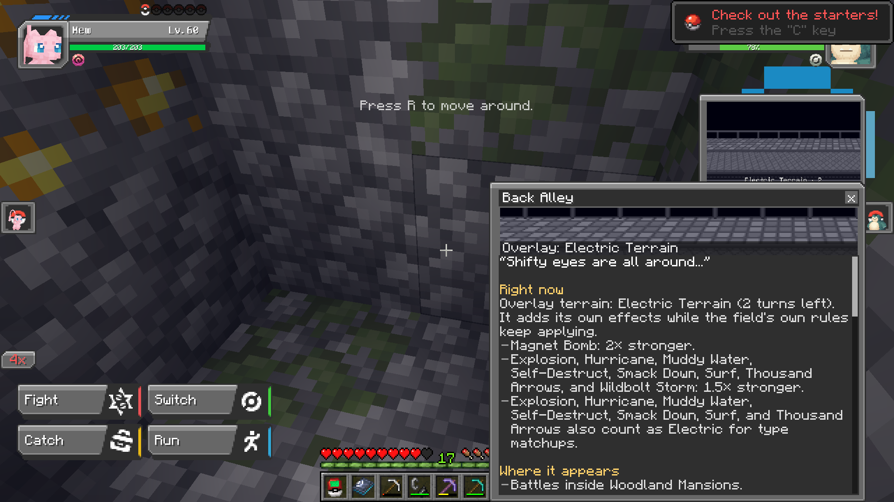

# Rejuvenation Fields

Data-driven **battle fields** for [Cobblemon](https://cobblemon.com) 1.7.3 on Minecraft 1.21.1 (Fabric), after the field system of the fan game *Pokémon Rejuvenation*. Where a wild battle happens (a forest, a cave, underwater, inside a village or an Ancient City) decides a field that changes type power, moves, abilities, weather, terrain and status for that battle, with the original messages. **Version 0.1** is the first public release.

**Scope: 57 original fields + 4 custom fields = 61.** All 57 Rejuvenation 14.0.14 fields are implemented and source-audited, and four Minecraft-inspired custom fields (Deep Dark, Pale Garden, Warped Forest, Crimson Forest) sit beside them. Every ordinary field-dependent branch in the original scripts is implemented with a passing regression test, or recorded as a custom-move, Crest, unreachable, unsupported or presentation-only exclusion ([coverage](docs/FIELD_COVERAGE.md)). Exhaustive live and multiplayer verification is **not** claimed ([limitations](docs/LIMITATIONS.md), [testing](docs/TESTING.md)).

*The field panel (captured from the 0.2.0 development build): the active field's backdrop and name above the battle log. Click it to open the Field Notes.*

## What you get

* **Field selection** by precedence: explicit/trainer field > underwater > configured structure (villages, Woodland Mansions, Bastions and Fortresses, Ancient Cities) > biome > default ([details](docs/FIELD_SELECTION.md), [mapping tables](docs/BIOME_MAPPING.md)). Frozen oceans, rivers and snowy plains are *layered* fields whose surface can melt to reveal the ground beneath ([layers](docs/ENVIRONMENT_LAYERS.md)).
* **A field panel and Field Notes**: the field's Rejuvenation backdrop and name above the battle log, and a formal rules overlay with public counters, whose text for the 57 original fields is taken from the Pokémon Rejuvenation Wiki under CC BY-SA 4.0 ([panel](docs/FIELD_PANEL.md), [how notes work](docs/FIELD_NOTES.md), [the full text of every note](field-notes/FIELD_NOTES.md)).
* **Exact, read-only previews**: the server measures a move with the field engine inside a transaction that restores everything (RNG, HP, statuses, items, counters); Cobblemon Battle Extras shows those exact ranges when the compat mod is installed ([integrations](docs/INTEGRATIONS.md)).
* **Trainer AI integration** (compat mod): Run & Bun and RCT trainers score moves with the field engine; a global NPC gimmick policy lets only declared Tera/Dynamax initiate and activates eligible Mega on the first legal move ([policy](docs/BATTLE_AI_POLICY.md), [trainer fields](docs/TRAINER_INTEGRATION.md)).
* **Five held items** with the original Rejuvenation icons and crafting recipes: Magical, Telluric, Synthetic and Elemental Seed and the Amplifield Rock (cross recipe `[" A ","ASA"," A "]` around a Cobblemon Grassy/Misty/Electric/Psychic Seed or Damp/Icy/Smooth/Heat Rock). Amulet Coin is unchanged.
* **Four custom fields** with full mechanics and a [validation report](docs/reports/custom-field-validation.md) tracing every specification statement to a test ([custom fields](docs/CUSTOM_FIELDS.md)).
* **An authoring kit**: add your own fields with data only, no engine edits ([guide](docs/CUSTOM_FIELD_AUTHORING.md)).

## Two mods, two data packs

| Artifact | Role | Required |
|---|---|---|
| `rejuvenation-fields-0.1.jar` | core mod: engine, selection, UI, items, recipes | yes |
| `rejuvenation-fields-base-0.1.zip` | portable data pack: all 61 fields and every vanilla/Cobblemon-supported mapping | yes |
| `rejuvenation-fields-compat-0.1.jar` | Run & Bun / RCT / Battle Extras integrations and the global NPC policy | optional |
| `rejuvenation-fields-cobbleverse-0.1.zip` | mappings for COBBLEVERSE's other mods and backports, the Kanto trainer fields and the Lt. Surge gym | optional, needs the base |

Supported combinations, pack order, what is missing without each optional piece, migration from the private 0.2.0 build and rollback: [docs/MIGRATION.md](docs/MIGRATION.md). The core never depends on the compat mod; the compat mod's three integrations load only when their mod is installed.

## Requirements

Minecraft 1.21.1, Fabric Loader ≥ 0.17.2, Fabric API ≥ 0.116.6, Cobblemon 1.7.3+1.21.1, Java 21. Optional integrations (compat mod): Run & Bun (`rbrctai`), RCT API (`rctapi`), Cobblemon Battle Extras. The COBBLEVERSE extension targets the COBBLEVERSE modpack's content (Terralith, VanillaBackport, Repurposed Structures, Cobblemon Additions, LumyMon, Legendary Monuments, Cobblemon Raid Dens). No game files are bundled and nothing from the original game is needed at runtime.

## Installation

1. Put `rejuvenation-fields-0.1.jar` (and optionally `rejuvenation-fields-compat-0.1.jar`) in `mods/` on the server and every client.
2. Put `rejuvenation-fields-base-0.1.zip` (and optionally `rejuvenation-fields-cobbleverse-0.1.zip`) in the world's `datapacks/`, or the required Global Packs data-pack folder, and load the world. The log shows `Loaded 61 fields`.
3. Natural wild battles now select a field; other trainer and player battles stay opt-in through `FieldApi`. Use a test profile first.

## Custom fields

Copy `research/custom-fields/_template/my_field.json`, change the documented fields, build a pack with `python research/build_custom_pack.py`, and load it: [docs/CUSTOM_FIELD_AUTHORING.md](docs/CUSTOM_FIELD_AUTHORING.md) walks through IDs, parent rules, secondary types, seeds, notes, mappings, precedence, testing and troubleshooting with a worked example.

## Building and testing

`./build.ps1` or `./gradlew check` plus `python research/package.py`; prerequisites, the environment variables that replace machine-specific paths, the layout (`core/`, `compat/`, `verification/`) and reproducibility notes are in [docs/BUILDING.md](docs/BUILDING.md). The architecture is described in [docs/ARCHITECTURE.md](docs/ARCHITECTURE.md).

## Known limitations

* Verified **offline** (the installed simulator, Cobblemon's shaded Graal runtime, Minecraft's recipe classes, the built jars). The 0.1 split and the new items have not been exercised in a live rendered game; earlier live checks were on the 0.2.0 build. Two-client multiplayer has never been tested.
* Global Packs load ordering of the COBBLEVERSE extension against the original COBBLEVERSE packs is relied on, not verified in a running game ([migration](docs/MIGRATION.md)).
* Custom Rejuvenation moves, Crests and other source-only content are excluded or reported as unavailable, never aliased ([limitations](docs/LIMITATIONS.md)).
* Several documented rounding resolutions (for example Warped Forest's Leech Seed) are within one HP of a literal reading ([custom fields](docs/CUSTOM_FIELDS.md)).

## License and credits

**No license has been chosen for this project's own code yet**, so all rights are reserved until the owner picks one ([LICENSE-STATUS.md](LICENSE-STATUS.md)). Third-party material, including the Pokémon Rejuvenation artwork this fan project reuses with credit, and its redistribution status, is listed in [THIRD_PARTY.md](THIRD_PARTY.md). *Pokémon* is © Nintendo, Creatures Inc. and GAME FREAK inc.; this is an unofficial, non-commercial fan project. See [CHANGELOG.md](CHANGELOG.md) and [CONTRIBUTING.md](CONTRIBUTING.md).
